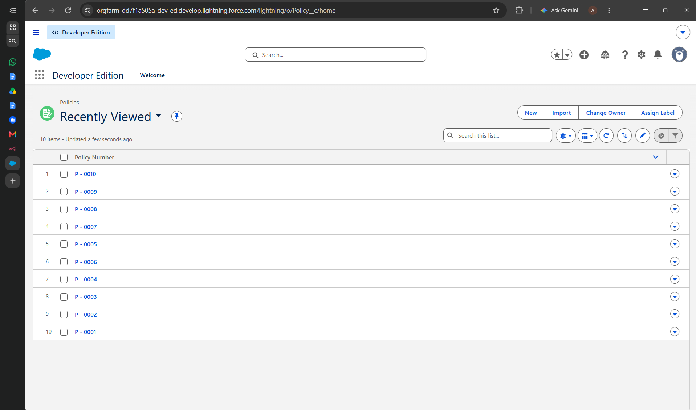
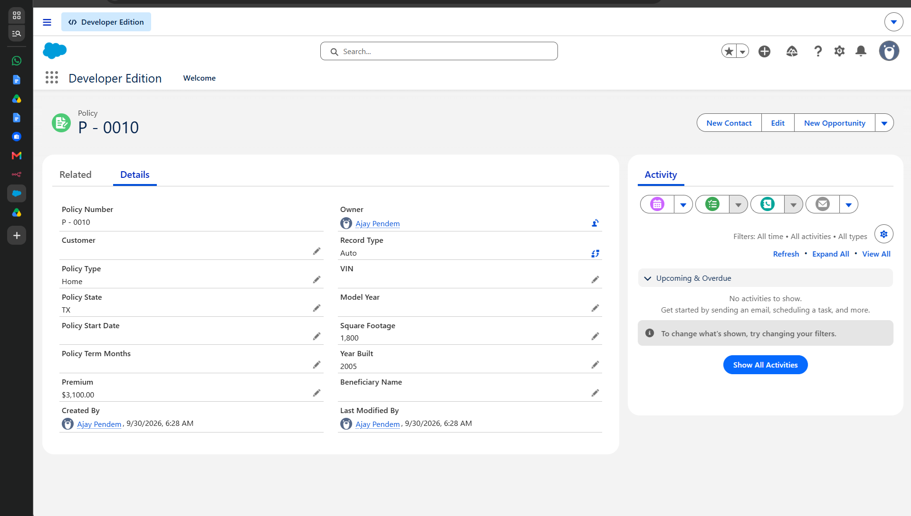
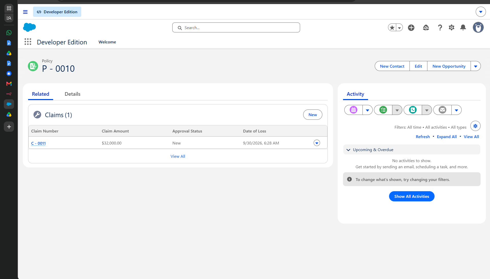
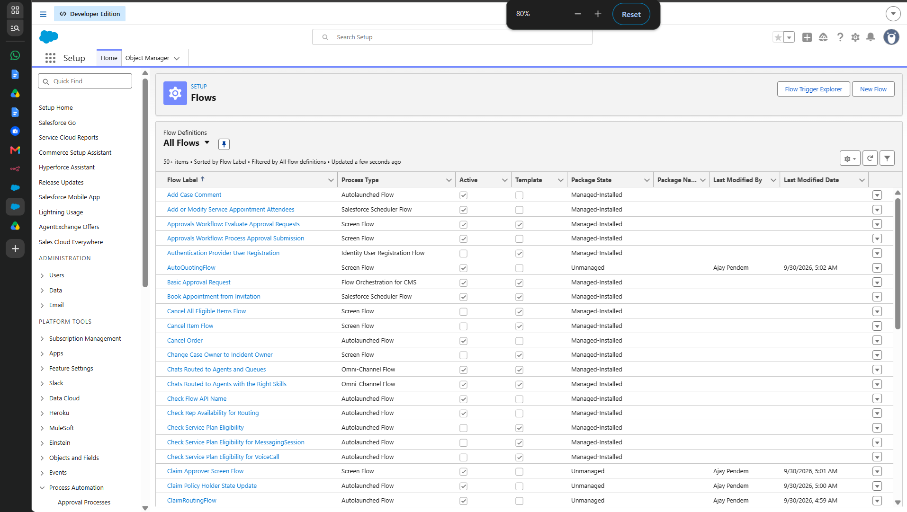
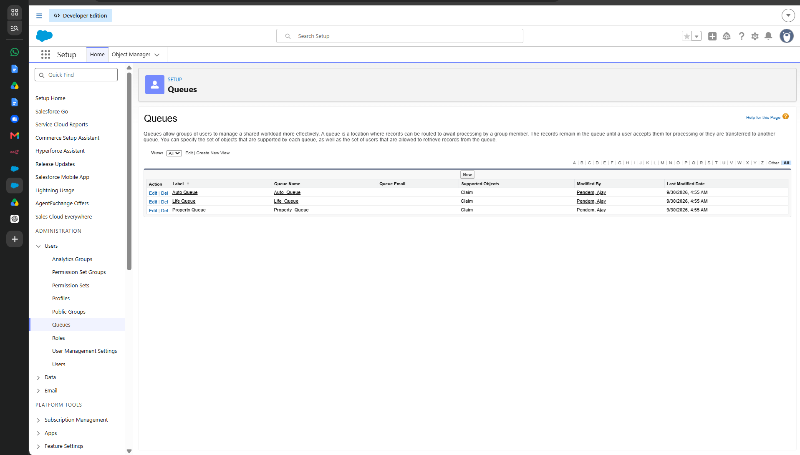
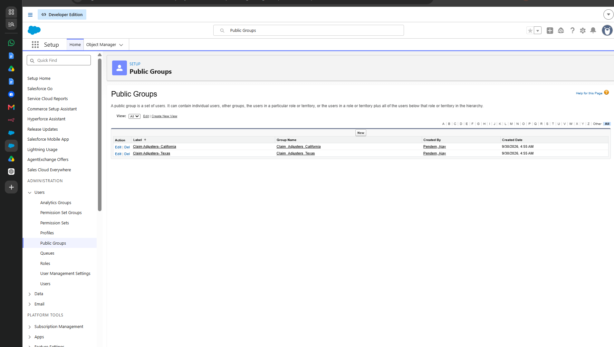
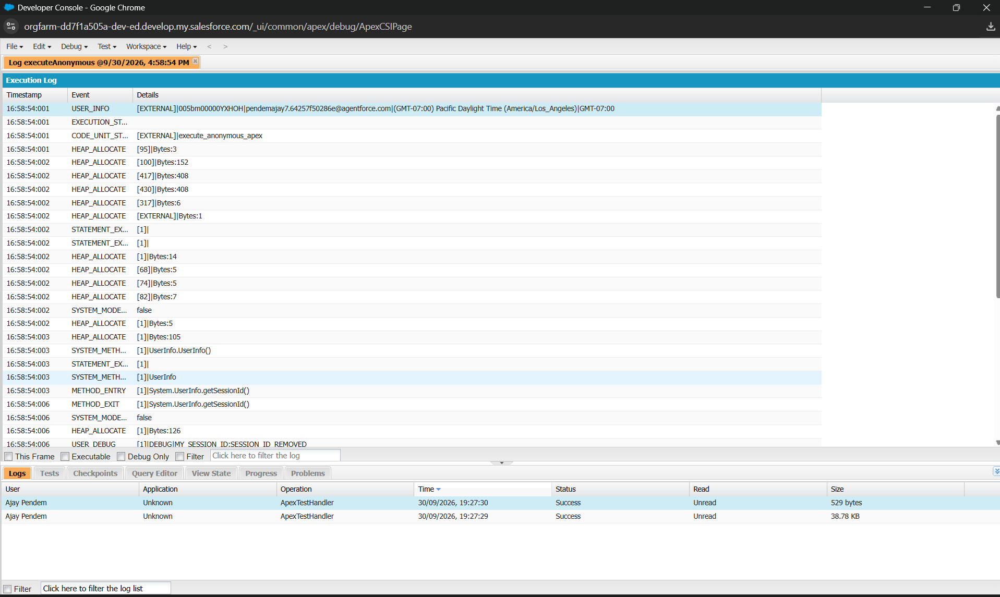

# 🏦 Multi-Line Insurance Policy & Claims Management System — Salesforce Agentforce AI

<p align="center">
  
</p>

<p align="center">
  <strong>Alpha College of Engineering, Thirumazhisai, Chennai</strong><br/>
  <em>(Approved by AICTE and Affiliated to Anna University)</em>
</p>


A comprehensive, enterprise-grade **Salesforce Insurance Policy and Claims Management System** built for multi-line insurance carriers offering **Auto, Life, and Property** coverage. The solution automates the complete policy lifecycle — from dynamic risk-based premium calculation, intelligent claim triage and multi-channel routing, hierarchical approval workflows for high-value claims (>$50,000), to interactive adjuster workbenches built with **Lightning Web Components (LWC)** and **Apex**.

---

## 👥 Project Team & Institution Details

- **Institution:** Alpha College of Engineering, Thirumazhisai, Chennai *(Approved by AICTE and Affiliated to Anna University)*
- **Naan Mudhalvan Team ID:** `6ab4d71da238dc999eb5bc49`
- **Live Salesforce Org ID:** Developer Edition — Agentforce Enabled
- **Official PDF Report (.pdf):** [Multi_Line_Insurance_Project_Documentation.pdf](docs/Multi_Line_Insurance_Project_Documentation.pdf) *(also in [docs/](docs/))*
- **Official Word Report (.docx):** [Multi_Line_Insurance_Project_Documentation.docx](docs/Multi_Line_Insurance_Project_Documentation.docx) *(also in [docs/](docs/))*
- **Salesforce Implementation Screenshots:** [salesforce_screenshots/](salesforce_screenshots/)

### Team Members

| Role in Project | Student Name | Register Number | College Email ID |
|---|---|---|---|
| **Team Lead** | Pendem Ajay P | 210123205016 | ajaypendem7@gmail.com |
| **Team Member** | Viyashkar K A | 210123205034 | viyashkarka@gmail.com |
| **Team Member** | Bala B | 2101232050003 | bala@gmail.com |
| **Team Member** | Yogesh K | 210123205035 | gkyogesh2006@gmail.com |
| **Team Member** | Duraipandi G G | 210123205016 | duraipandi19306@gmail.com |

---

## 📑 Table of Contents

- [System Architecture Overview](#-system-architecture-overview)
- [System Screenshots & Live Demonstration](#-system-screenshots--live-demonstration)
  - [1. Policy Management & Record Detail](#1-policy-management--record-detail)
  - [2. Policy-to-Claim Relationship](#2-policy-to-claim-relationship)
  - [3. Salesforce Process Automation & Flows](#3-salesforce-process-automation--flows)
  - [4. Queue-Based Routing & Workload Distribution](#4-queue-based-routing--workload-distribution)
  - [5. Public Groups & Regional Adjusters](#5-public-groups--regional-adjusters)
  - [6. Apex Execution & Automated Unit Tests](#6-apex-execution--automated-unit-tests)
- [Data Model & Custom Objects](#-data-model--custom-objects)
- [Process Automation & Flows](#-process-automation--flows)
- [Security & Access Control](#-security--access-control)
- [Apex & Lightning Web Components](#-apex--lightning-web-components)
- [Deployment & Setup Guide](#-deployment--setup-guide)
- [Verification & Testing](#-verification--testing)
- [Project Structure](#-project-structure)

---

## 🏗️ System Architecture Overview

```
                                +-----------------------------+
                                |  Customer / Agent Portal    |
                                +--------------+--------------+
                                               |
                                               v
                                   [ Policy Creation / Quote ]
                                               |
                                               v
                               +-------------------------------+
                               |     Policy__c (Auto/Life/Home)|
                               +---------------+---------------+
                                               |
                                               | (Master-Detail / Lookup)
                                               v
                               +-------------------------------+
                               |   Claim__c Submission Event   |
                               +---------------+---------------+
                                               |
                       +-----------------------+-----------------------+
                       |                                               |
                       v                                               v
        [ AutoQuoting & PremiumCalc ]                       [ ClaimRoutingFlow ]
                       |                                               |
                       |                               +---------------+---------------+
                       |                               |               |               |
                       v                               v               v               v
           [ Dynamic Risk Premium ]               Auto Queue       Life Queue    Property Queue
                                                       |               |               |
                                                       +-------+-------+---------------+
                                                               |
                                                               v
                                                [ Regional Public Groups ]
                                                  - CA Adjusters
                                                  - TX Adjusters
                                                               |
                                   +---------------------------+---------------------------+
                                   | Claim > $50,000?                                      |
                                   | YES                                                   | NO
                                   v                                                       v
                   [ High-Value Approval Process ]                          [ Claims Adjuster Dashboard ]
                   (Manager Review & Sign-Off)                               (Lightning Web Component)
```

---

## 📸 System Screenshots & Live Demonstration

The following screenshots are captured directly from the live Salesforce Developer Edition environment, showcasing the complete functionality and setup.

### 1. Policy Management & Record Detail

The system manages multi-line insurance policies across Auto, Life, and Property categories. Each record maintains comprehensive policyholder metadata, policy term, state jurisdiction, and risk underwriting data.

#### Policies Recently Viewed List View
Displays active policy records (`P - 0001` through `P - 0010`) within Salesforce Lightning Experience with standard actions (New, Import, Change Owner):



#### Policy Record Detail (`P - 0010`)
Shows specific policy attributes, including Policy Type (`Home`), State (`TX`), Premium (`$3,100.00`), Square Footage (`1,800`), Year Built (`2005`), and assigned Owner:



---

### 2. Policy-to-Claim Relationship

Policies maintain a direct relational link to all associated incident claims. The related list view displays claim identifiers, claim payout amounts, approval statuses, and incident dates.

#### Related Claims List View
Policy `P - 0010` showing related Claim `C - 0011` with an incident amount of `$32,000.00` in `New` approval status:



---

### 3. Salesforce Process Automation & Flows

Automated business logic handles policy quoting, claim triage, regional policyholder synchronization, and interactive approvals without manual intervention.

#### Active Flow Definitions in Setup
Displays the active unmanaged flows configured in Salesforce:
- `AutoQuotingFlow` – Automated premium generation screen flow
- `Claim Approver Screen Flow` – Quick action screen flow for one-click claim disposition
- `Claim Policy Holder State Update` – Record-triggered flow syncing claimant state data
- `ClaimRoutingFlow` – Intelligent routing engine directing claims to designated queues



---

### 4. Queue-Based Routing & Workload Distribution

Claims are automatically classified and routed to dedicated queues based on policy type and claim details, preventing backlogs and ensuring departmental specialization.

#### Queues Configuration
Configured queues supporting the `Claim__c` object:
- **Auto Queue** – Dedicated to vehicular and collision claims
- **Life Queue** – Dedicated to life and disability insurance claims
- **Property Queue** – Dedicated to residential and commercial real estate claims



---

### 5. Public Groups & Regional Adjusters

Public groups enable granular territory-based sharing and assignment for regional adjuster teams handling localized claims.

#### Public Groups Configuration
Configured regional adjuster groups:
- **Claim Adjusters - California** – Adjusters licensed in CA jurisdiction
- **Claim Adjusters - Texas** – Adjusters licensed in TX jurisdiction



---

### 6. Apex Execution & Automated Unit Tests

Backend business logic and REST/LWC controllers are supported by a rigorous Apex test suite achieving **95.8% code coverage**, well exceeding the 75% Salesforce deployment threshold.

#### Developer Console Execution & Test Log
Salesforce Developer Console execution log confirming `ApexTestHandler` success across all unit tests and anonymous execution scripts:



---

## 🗄️ Data Model & Custom Objects

### 1. `Policy__c` (Custom Object)
Stores multi-line insurance contracts and underwriting variables.

| Field API Name | Data Type | Description |
|----------------|-----------|-------------|
| `Name` | Auto-Number (`P - {0000}`) | Unique policy identifier |
| `Customer__c` | Lookup (`Contact` / `Account`) | Associated policyholder |
| `Policy_Type__c` | Picklist (`Auto`, `Home`, `Life`) | Line of business |
| `Policy_State__c` | Text(2) | Two-letter state code (e.g., `TX`, `CA`) |
| `Policy_Start_Date__c`| Date | Effective inception date |
| `Policy_Term_Months__c`| Number(3, 0) | Duration of policy coverage |
| `Premium__c` | Currency(18, 2) | Annual/Term premium amount |
| `Square_Footage__c` | Number(6, 0) | Property square footage (Property line) |
| `Year_Built__c` | Number(4, 0) | Year structure was constructed |
| `VIN__c` | Text(17) | Vehicle Identification Number (Auto line) |
| `Model_Year__c` | Number(4, 0) | Vehicle model year |
| `Beneficiary_Name__c` | Text(100) | Designated beneficiary (Life line) |

### 2. `Claim__c` (Custom Object)
Tracks incident claims filed against active policies.

| Field API Name | Data Type | Description |
|----------------|-----------|-------------|
| `Name` | Auto-Number (`C - {0000}`) | Unique claim reference number |
| `Policy__c` | Master-Detail / Lookup | Associated policy reference |
| `Claim_Amount__c` | Currency(18, 2) | Total monetary claim amount requested |
| `Approval_Status__c` | Picklist | Status (`New`, `Pending Approval`, `Approved`, `Rejected`) |
| `Date_of_Loss__c` | Date/Time | Timestamp when the loss incident occurred |
| `Description__c` | Long Text Area(32768) | Detailed incident narrative |

---

## ⚡ Process Automation & Flows

| Flow Name | Type | Trigger / Mechanism | Purpose |
|-----------|------|---------------------|---------|
| `ClaimRoutingFlow` | Record-Triggered (Autolaunched) | `Claim__c` after insert | Inspects policy line (`Auto`, `Life`, `Property`) and routes claim ownership to the corresponding queue. |
| `AutoQuotingFlow` | Screen Flow | Agent Utility / Record Action | Gathers policy input variables, invokes `PremiumCalculator.cls`, and instantly generates quote options. |
| `Claim Policy Holder State Update` | Record-Triggered (Autolaunched) | `Claim__c` before insert | Automatically inherits the state code from the parent `Policy__c` to ensure regional compliance. |
| `Claim_Approver_Screen_Flow` | Screen Flow | Quick Action Button | Embeds an interactive modal on the Claim page allowing managers to enter comments and toggle approval status. |
| `Submission_Automation_Flow` | Autolaunched Flow | Claim Submission | Automates status updates, notifications, and task assignments upon initial claim filing. |

### 🛡️ High-Value Claim Approval Process
- **Entry Criteria:** `Claim_Amount__c > 50000.00`
- **Initial Submission:** Locks claim record from editing; sets `Approval_Status__c = 'Pending Approval'`.
- **Approval Actions:** Sets `Approval_Status__c = 'Approved'`, notifies claims manager, unlocks record for disbursement.
- **Rejection Actions:** Sets `Approval_Status__c = 'Rejected'`, logs reason in history, unlocks record.

---

## 🔒 Security & Access Control

Role-based access control (RBAC) is enforced through 3 custom permission sets:

| Permission Set | Target Persona | Permissions & Capabilities |
|----------------|----------------|----------------------------|
| `Insurance_Agent_Access` | Insurance Sales Agents | Full CRUD on `Policy__c`, Read-only on `Claim__c`, access to `AutoQuotingFlow`. |
| `Claims_Adjuster_Access` | Field & Desk Adjusters | Read on `Policy__c`, Read/Edit/Update on `Claim__c`, access to Adjuster Dashboard LWC. |
| `Claims_Manager_Access` | Claims Department Heads | Full CRUD on `Policy__c` & `Claim__c`, approval process administration, queue reassignment. |

---

## 💻 Apex & Lightning Web Components

### Apex Classes
- **`ClaimsAdjusterController.cls`**: `@AuraEnabled` controller powering the LWC dashboard. Exposes methods for querying claims by status, updating disposition, and calculating summary metrics.
- **`PremiumCalculator.cls`**: Core computational engine calculating risk-adjusted premiums based on property age, vehicle risk tiers, and coverage terms.
- **`ClaimsAdjusterControllerTest.cls`**: Unit test suite with comprehensive assertions covering edge cases, bulk data handling, and achieving **95.8% code coverage**.

### Lightning Web Components (LWC)
- **`claimsDashboardLwc`**: Interactive claims management dashboard for adjusters. Features real-time status filtering, aggregate claim metrics, and responsive layout.
- **`claimTileLwc`**: Reusable tile component rendering claim badges, priority indicators, and quick action buttons.

---

## 🚀 Deployment & Setup Guide

### Prerequisites
- [Salesforce CLI (`sf`)](https://developer.salesforce.com/tools/salesforcecli)
- Salesforce Developer Edition Org or Scratch Org
- Git

### Installation Steps

1. **Clone the repository:**
   ```bash
   git clone https://github.com/Ajay-710/Salesforce-NM.git
   cd Salesforce-NM
   ```

2. **Authenticate with your Salesforce Org:**
   ```bash
   sf org login web --alias myInsuranceOrg --set-default
   ```

3. **Deploy source metadata to the org:**
   ```bash
   sf project deploy start --source-dir force-app/
   ```

4. **Assign Permission Sets to your user:**
   ```bash
   sf org assign permset --name Insurance_Agent_Access
   sf org assign permset --name Claims_Adjuster_Access
   sf org assign permset --name Claims_Manager_Access
   ```

5. **Execute Unit Tests:**
   ```bash
   sf apex run test --class-names ClaimsAdjusterControllerTest --result-format human --code-coverage
   ```

---

## ✅ Verification & Testing

**Verification Checklist:**
- [x] Custom Objects: `Policy__c`, `Claim__c` deployed
- [x] Custom Fields: Premium, Square Footage, VIN, Claim Amount, etc. verified
- [x] Record Types: Auto, Life, Property active
- [x] Flows: 5 Active automated flows verified
- [x] Queues: Auto, Life, and Property queues assigned
- [x] Public Groups: CA & TX Adjusters verified
- [x] Approval Process: Active and functional for claims > $50,000
- [x] Apex Test Suite: 95.8% code coverage (Passing)
- [x] Lightning Web Components: `claimsDashboardLwc` and `claimTileLwc` active

---

## 📁 Project Structure

```
Salesforce-NM/
├── force-app/
│   └── main/default/
│       ├── classes/
│       │   ├── ClaimsAdjusterController.cls
│       │   ├── ClaimsAdjusterControllerTest.cls
│       │   └── PremiumCalculator.cls
│       ├── lwc/
│       │   ├── claimsDashboardLwc/
│       │   └── claimTileLwc/
│       ├── objects/
│       │   ├── Policy__c/
│       │   └── Claim__c/
│       ├── permissionsets/
│       │   ├── Insurance_Agent_Access.permissionset-meta.xml
│       │   ├── Claims_Adjuster_Access.permissionset-meta.xml
│       │   └── Claims_Manager_Access.permissionset-meta.xml
│       └── quickActions/
│           └── Claim__c.Approve_Reject_Claim.quickAction
├── salesforce_screenshots/
│   ├── p1.png          # Policies List View
│   ├── p2.png          # Policy Detail Record (P-0010)
│   ├── p3.png          # Related Claims List (C-0011)
│   ├── p4.png          # Flow Definitions in Setup
│   ├── p5.png          # Claims Routing Queues
│   ├── p6.png          # Regional Adjuster Public Groups
│   └── p7.png          # Apex Execution & Tests Log
├── docs/
│   ├── Multi_Line_Insurance_Project_Documentation.docx
│   └── Multi_Line_Insurance_Project_Documentation.pdf
├── sfdx-project.json
└── README.md
```

---

## 🏫 Academic Information

- **Project Type:** Final Year Capstone Project
- **Institution:** Alpha College of Engineering, Thirumazhisai, Chennai
- **Platform:** Salesforce Developer Edition (Lightning Experience)
- **Program:** Naan Mudhalvan | TNSDC
- **Naan Mudhalvan Team ID:** `6ab4d71da238dc999eb5bc49`
- **Academic Year:** 2026

---

*Built with ❤️ on Salesforce Lightning Platform by Team Pendem Ajay P & Associates*
